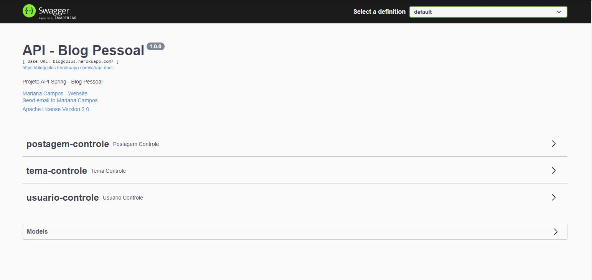

<h2 align="center">Repositório do Backend do Blog Pessoal</h2>

<h4 align="center"> ✅ Backend - Blog Pessoal 📝 Concluído ✅ </h4>

----

## Demonstração 🎬 
Para realizar o deploy do backend, utilizamos o serviço em nuvem da Heroku, e como banco de dados, o Postgres.
Como desenvolvemos o back primeiro, não tinhamos a parte da estilização, para contornar essa situação, foi utilizado o Swagger para exibir a interface descrevendo nossa API RESTful.

----

Ao acessar o link do Swagger (disponibilizado no final desse tópico e na descrição do repositório), você irá se deparar com os CRUDs realizados na aplicação e a model da API.

Caso seja solicitado um usuário e senha, utilize:

<code>
Usuário: root
</code>
<code>
Senha: root
</code>

Super seguro não é mesmo? 😎

<a href="https://blogcplus.herokuapp.com/swagger-ui/"><a>

---

## Tecnologias Utilizadas

<h2>Autora</h2>

Feito com ❤️ por Mariana Campos 👋🏽 Entre em contato!

 

